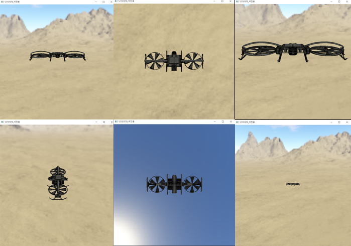
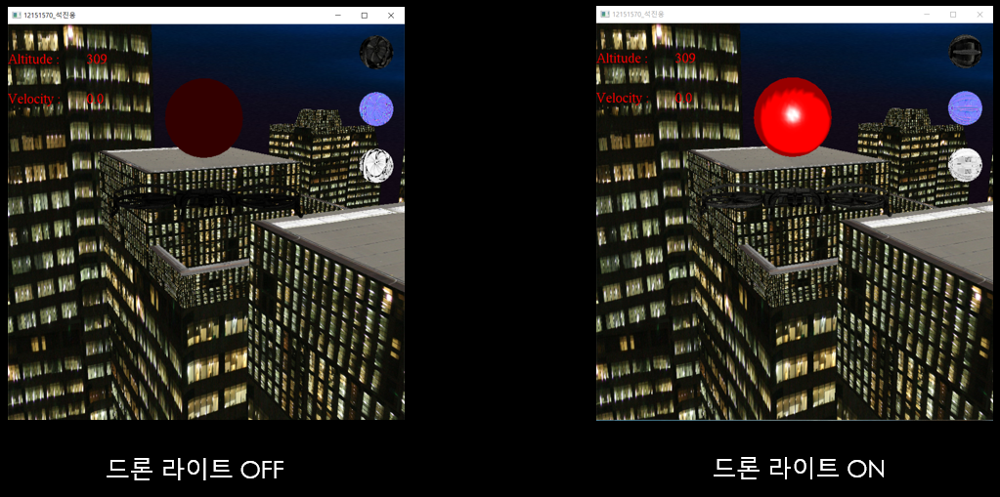
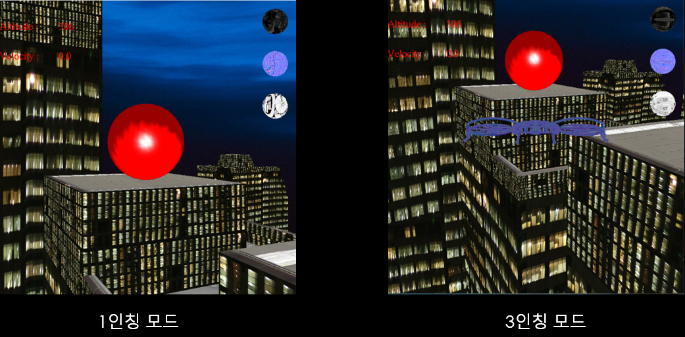

# 3D Drone modeling
Computer graphics project  
e-mail address : jinwoong.it@gmail.com  
Youtube : https://youtu.be/CqEK6O8Ulgw  

## Introduction
- 3D 드론 모델링  
- OpenGL을 사용해 드론 비행 프로그램 제작  
- 드론 기능 구현(비행, 라이트 on/off, Clocking mode)  

## Development Environment
- Visual Studio IDE  
- OpenGL  

## Screenshots
- Drone  
  
- Light mode  
  
- Camera view  
  